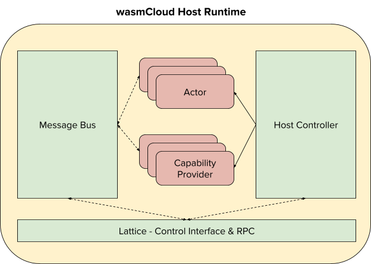

# wasmCloud介绍

[wasmCloud](https://github.com/wasmCloud) 是一个构建在waPC之上的开源项目，它为我们提供了一种将强类型模式分配给在主机和参与者(WebAssembly模块)之间传递的消息的方法。它还提供了自己的分布式计算主机运行时，以及一个自形成、自修复的网状网络(称为“晶格”)，我们将在后面的课程中使用它。正如我们在对wasmCloud的探索中所看到的，它有一个深刻的、企业级的安全机制、对大规模的支持，以及一种可以用来生成强类型消息的模式定义语言。

wasmCloud主机运行时本质上是一个代理或调度程序:它管理生态系统中两个核心组件之间的通信:参与者和功能提供者。请看下面的架构图，它展示了单个wasmCloud主机进程的内部结构:

在上面的图中，您可以看到在任何给定的主机(OS进程)中，都有许多参与者(WebAssembly模块使用代码生成的数据结构通过waPC与主机通信)和功能提供者。主机控制器管理启动、停止和监控，而消息总线促进了主机内部和外部跨网格(稍后讨论)的通信，这允许远程函数调用和远程控制接口。

我们已经讨论了什么是参与者，但是什么是[能力提供者](https://wasmcloud.dev/reference/host-runtime/capabilities/) 呢?在本课程的WebAssembly基础部分，我们详细讨论了WebAssembly模块的局限性——它们能做什么和不能做什么。他们不能做的是访问操作系统。它们不能(至少在当前规范中不能)进行网络调用、操作套接字、读写文件(没有WASI)。总之，它们只能执行[纯函数](https://en.wikipedia.org/wiki/Pure_function) ，除非请求宿主代表它们执行副作用。

正如其名称所示，能力提供者为参与者提供对高级能力的访问。提供者的例子包括消息代理、日志机制、键值存储、图形数据库、基于关系/ sql的数据库、web服务器、web客户端，甚至[telnet服务器](https://github.com/wasmCloud/capability-providers/tree/main/telnet) 。此外，能力提供者系统是完全可插入的，因此平台构建者可以快速且轻松地创建自己的自定义能力，以向参与者公开功能。