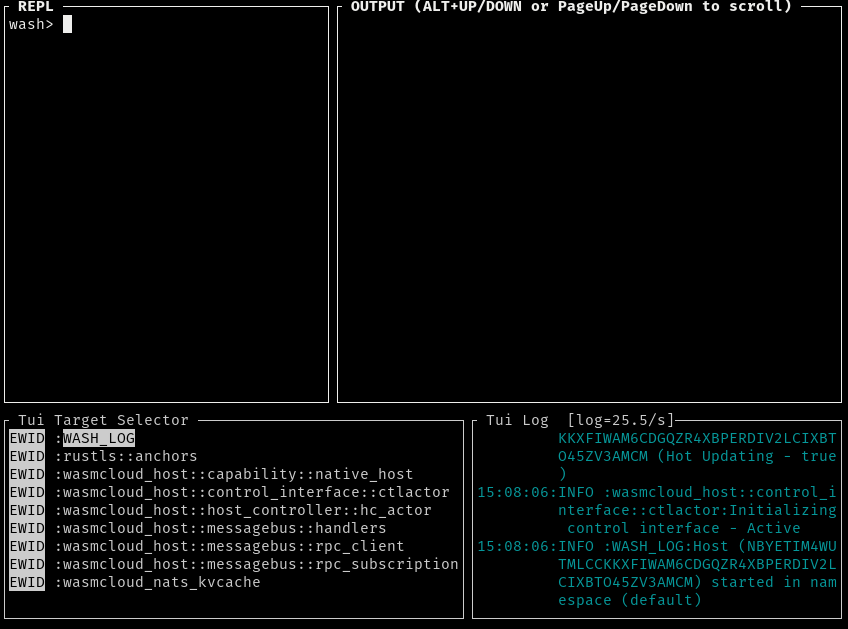

# 在wasmCloud Shell中运行参与者(2)

你会立即看到如下图所示的屏幕。注意，您可能需要调整/最大化您的终端会话，因为清洗REPL在有足够空间的情况下看起来最好。



输入quit退出REPL。现在，我们将使用一个清单文件，这样我们就可以快速而轻松地创建一个主机来加载和配置我们想要的一切。[清单文件](https://wasmcloud.dev/reference/host-runtime/manifest/) 支持环境变量的替换，所以在你的shell中，你要设置一个环境变量，其中包含你从**wash claims inspect**的输出中获得的actor公钥:

<font color=Blue>export VAULT_ACTOR=MAHUHHQNILLDRPX5IRNOVUH2U2SCTSJ636E42G4TCIBKAQFOBUSS74TW</font>

接下来，要创建清单，请在项目目录中创建一个名为**manifest.yaml**的文件的内容如下:

```text
---
actors:
  - ./target/wasm32-unknown-unknown/debug/playervault_s.wasm
capabilities:
     - image_ref: wasmcloud.azurecr.io/redis:0.11.2
     - image_ref: wasmcloud.azurecr.io/httpserver:0.12.1
links:
  - actor: ${VAULT_ACTOR}
     contract_id: "wasmcloud:keyvalue"
     provider_id: "VAZVC4RX54J2NVCMCW7BPCAHGGG5XZXDBXFUMDUXGESTMQEJLC3YVZWB"
     values:
     URL: redis://0.0.0.0:6379/
  - actor: ${VAULT_ACTOR}
     contract_id: "wasmcloud:httpserver"
     provider_id: "VAG3QITQQ2ODAOWB5TTQSDJ53XK3SHBEIFNK4AYJ5RKAX2UNSCAPHA5M"
     values:
       PORT: 8080
```

正如您可能知道的，YAML在涉及制表符和空格时非常挑剔，因此如果复制和粘贴不起作用，您可以使用**manifest.yaml**文件来自本章的代码示例。

您可能已经注意到，这个示例使用Redis作为键值存储。如果你没有一个Redis实例运行在你的工作站上，你可以简单地启动一个Redis docker镜像端口6379映射如下:

<font color=Blue>docker run -p 6379:6379 -d redis</font>

当我们使用这个清单启动主机时，我们将获得一个HTTP服务器、一个键值存储提供程序(Redis)、启动正在运行的参与者，并配置参与者和功能提供程序之间的链接定义。要启动主机，在shell提示符中输入以下内容:

<font color=Blue>wasmcloud -m ./manifest.yaml</font>

在下一页继续。