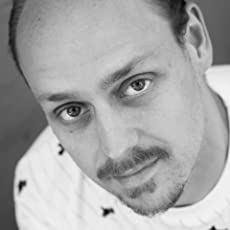

# 来见见你的导师:Kevin Hoffman

凯文·霍夫曼(Kevin Hoffman)从10岁起就开始开发软件，当时他的祖父修理了一台老式的Commodore VIC-20，只带了一本BASIC编程手册和一台磁带机就把它送给了他。从那时起，他就迷上了各种各样的计算问题，从构建虚拟世界到生物识别到无人机飞行计划，以及他目前的痴迷——分布式系统、云本地开发和WebAssembly的交集。

他著有《Programming WebAssembly with Rust》、《Cloud Native Go》等十几本关于。net框架各个方面的书籍。在过去的两年里，他曾在WebAssembly上参加过很多会议和活动，也参加过很多之前的会议，从。net到Spring Boot到Redis，甚至在苹果的WWDC上。